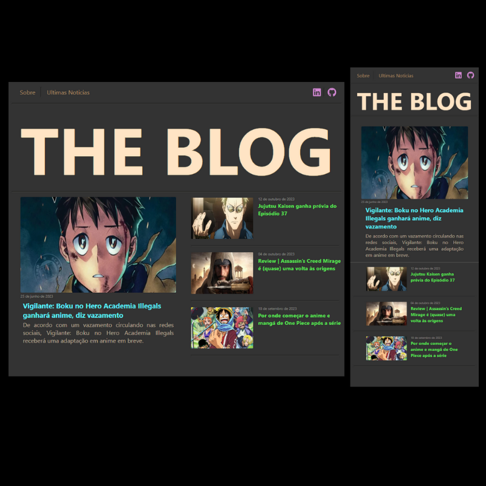

<h1 align="center">Projeto Blog usando Angular</h1>

  

  
  <h2>📋 Introdução</h2>

  - Objetivo desse projeto é criar um Blog utilizando os meus conhecimentos basicos de estudo com o `Framework Angular`.

  - O projeto possui sua versão web para ``desktop`` e também a versão para dispositivos mobile, ``tablet e smartphone``.

  [](https://henferreirapro.github.io/projeto-blog-angular/)

___
<br>
<h2>📲 Pré-Requisitos Para Rodar Esse Projeto</h2>

  - Antes de começar, certifique-se de ter o Node.js e o Angular CLI instalados. Caso contrário, siga as etapas abaixo:

  1 - Você precisará do Node.js instalado em sua máquina. Você pode baixá-lo em [**nodejs.org**](https://nodejs.org/).

  2 - Abra o terminal ou prompt de comando.

  3 - Execute o seguinte comando para instalar a ``Angular CLI``(versão mais recente) globalmente:
  
  ```bash
    npm install -g @angular/cli
  ```

___
<br>
<h2>💻 Como Clonar Esse Projeto na Sua Maquina Localmente</h2>

  - Siga estas etapas para adicionar este projeto na sua máquina local:

  1 - Clonando o Repositório:
  
  - Comece clonando este repositório em sua máquina local usando o seguinte comando:
  ```bash
    git clone https://github.com/henferreirapro/projeto-blog-angular.git
  ```

  2 - Acessando o Projeto:
  
  - Abra seu terminal e navegue até o diretório do projeto:
  ```bash
    cd projeto-blog-angular
  ```

  3 - Instalando as Dependencias do Projeto:
  
  - use o comando ``install`` para instalar as dependências necessárias no projeto:
  ```bash
    npm install
  ```

  4 - Execute o servidor de desenvolvimento: 
  - Inicie o ``servidor`` de desenvolvimento usando o seguinte comando:
  ```bash
    ng serve
  ```

  5 - Abra o Projeto no seu navegador:
  - Após executar o ``servidor`` abra o seu navegador e execute o link do site do servidor.
  - Normalmente o link é ``http://localhost:4200/``.

___
